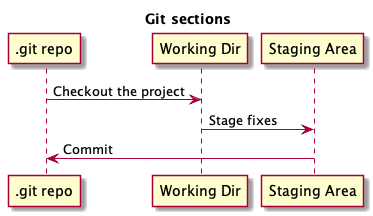
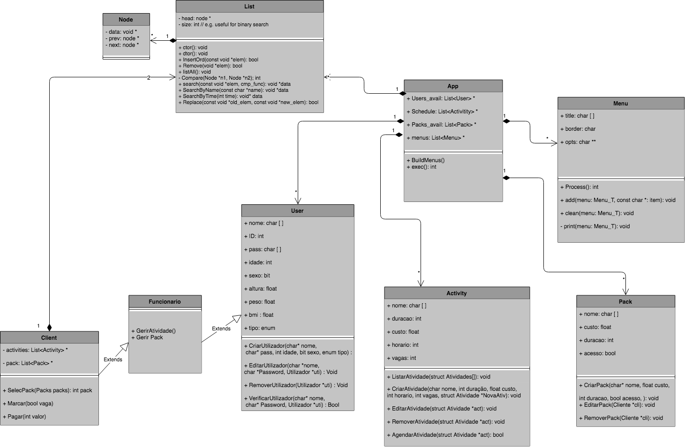
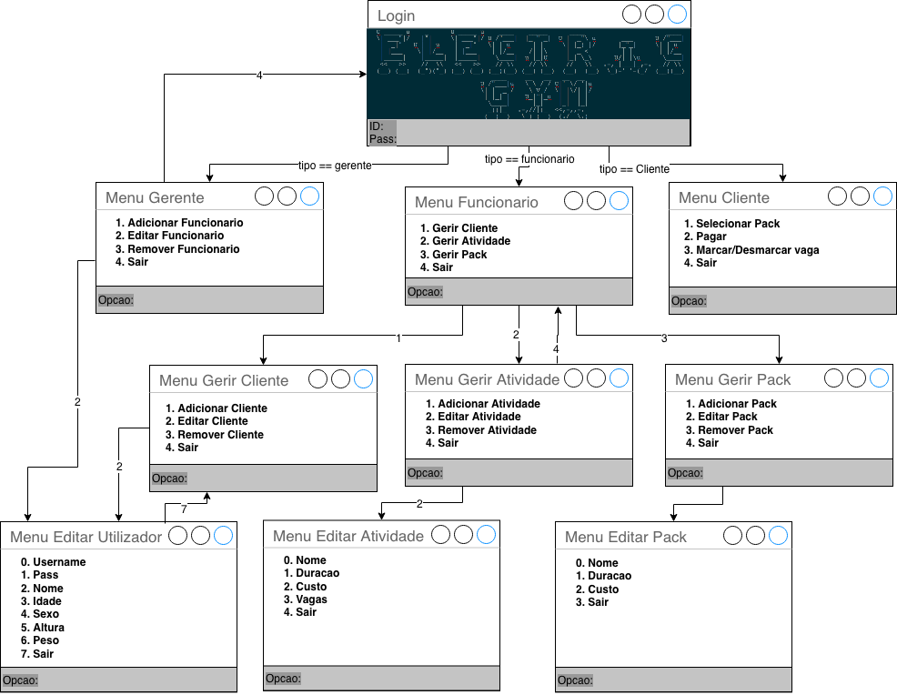

- [v1](#org99c0837)
  - [Notas](#org5a31989)
  - [Tarefas <code>[0/6]</code>](#org9d3ad01)
  - [Git Basics](#org993b2d7)
    - [Git basics](#orge7acf9d)
    - [[Git Tutorial](https://kbroman.org/github_tutorial/)](#org51638ae)
    - [[Contribute to someone's repository](http://kbroman.org/github_tutorial/pages/fork.html)](#org0de91bc)
  - [Git workflow](#orga942f9e)
  - [Ze](#org7d4fc62)
  - [Edu](#orgc364876)
  - [Gonçalo](#org26ba449)
- [v2](#orgc0616dd)
  - [Listas ligadas](#org9d67b23)
    - [Funções](#orgb47650e)
  - [Apontadores opacos (Opaque pointers)](#org58f6ebf)
  - [Módulos](#orgfd7c963)
  - [Ficheiros](#org09ed3d4)
  - [Exemplo Listas](#org42b9b6b)
  - [User Interface (UI)](#org98a6582)
  - [Aplicação](#orgb206bab)
    - [State functions and Event Handlers](#org164abf3)
- [Menus](#org24087ac)
- [Modules](#orgae6cd5c)
- [List](#org82e8380)
- [Database](#orgdb7a878)
  - [Considerações de Design](#orga11b146)

Last modified: <span class="timestamp-wrapper"><span class="timestamp">&lt;2018-11-11 Sun&gt;</span></span>


<a id="org99c0837"></a>

# v1

Versão com módulos e implementação com listas ligadas.


<a id="org5a31989"></a>

## Notas

Cada elemento do grupo fica responsável por um módulo:

-   *Ze*: User & Menu
-   *Edu*: Activity
-   *Gonçalo*: Pack


<a id="org9d3ad01"></a>

## Tarefas <code>[0/6]</code>

Semana <span class="timestamp-wrapper"><span class="timestamp">&lt;2018-11-12 Mon&gt;</span></span>:<span class="timestamp-wrapper"><span class="timestamp">&lt;2018-11-16 Fri&gt; </span></span> - **Análise**

1.  [ ] **Análise** - inclusão de funcionalidades:
    1.  incluir pesquisa/sort;
    2.  incluir ficheiros para base de dados de:
        -   Users
        -   Actividades
        -   Packs
2.  [ ] Criar repositório git (github)
3.  [ ] Workflow git

Semana <span class="timestamp-wrapper"><span class="timestamp">&lt;2018-11-19 Mon&gt;</span></span>:<span class="timestamp-wrapper"><span class="timestamp">&lt;2018-11-26 Mon&gt; </span></span> - **Design**

1.  [ ] **Design** - design de algoritmos para:
    1.  incluir pesquisa/sort;
    2.  incluir design de al para base de dados de:
        -   Users
        -   Actividades
        -   Packs


<a id="org993b2d7"></a>

## Git Basics


<a id="orge7acf9d"></a>

### Git basics

[src](https://git-scm.com/book/en/v2/Getting-Started-Git-Basics) Git has 3 main states that your files can reside in:

-   *committed*: data is safely stored in your local database
-   *modified*: file has changed but it has not yet been commited to the local database
-   *staged*: a modified file was **marked** in its current version to go into the next commit snapshot



This leads us to the main sections of a Git proj:

1.  **Git directory**: the Git directory is where Git stores the metadata and object database for your project. This is the most important part of Git, and it is what is copied when you clone a repository from another computer.

2.  **Working tree**: the working tree is a *single checkout of one version of the project*. These files are pulled out of the compressed database in the Git directory and placed on disk for you to use or modify.

3.  **Staging area**: the staging area is a file, generally contained in your Git directory, that stores information about what will go into your next commit. Its technical name in Git parlance is the “index”, but the phrase “staging area” works just as well.

The basic Git workflow goes something like this:

1.  You modify files in your working tree.

2.  You selectively stage just those changes you want to be part of your next commit, which adds only those changes to the staging area.

3.  You do a commit, which takes the files as they are in the staging area and stores that snapshot permanently to your Git directory.


<a id="org51638ae"></a>

### [Git Tutorial](https://kbroman.org/github_tutorial/)


<a id="org0de91bc"></a>

### [Contribute to someone's repository](http://kbroman.org/github_tutorial/pages/fork.html)


<a id="orga942f9e"></a>

## Git workflow

O branch estável será o `master` gerido pelo Zé. Este conterá apenas o código estável. Assim, para desenvolver qq funcionalidade, cada elemento do grupo deverá fazer o branch do `master`, atribuindo-lhe um nome relativo à funcionalidade implementada, p.ex. `search-user`. Este branch será depois `pushed` para o repositório `master`, sendo que será aceite se estiver de acordo com as especificações, ou serão sugeridas alterações que o elemento deverá implementar.

1.  Branch (`git checkout <branchname>`)
2.  Develop code
3.  Add to tracking (`git add file`)
4.  Add to *staging area* (transitory) (`git commit -m "Added search User function"`)
5.  If the code is good, upload to remote repository. (`git push <branchname`).


<a id="org7d4fc62"></a>

## Ze


<a id="orgc364876"></a>

## Edu


<a id="org26ba449"></a>

## Gonçalo

1.  Aprender Git


<a id="orgc0616dd"></a>

# v2


<a id="org9d67b23"></a>

## Listas ligadas

As listas ligadas são contentores para os tipos de dados criados por nós, nomedamente, `User`, `Menu`, `Activity` e `Pack`.

As listas são duplamente ligadas, i.e., possuem apontadores para o nó anterior (*previous*) e para o próximo(*next*). Isto facilita a inserção no meio de 2 nós. Adicionalmente são incluídos 2 apontadores para a cabeça (*first*) e para a cauda (*last*) que permitem percorrer a lista de frente para trás e de trás para a frente. Não iremos explorar muito esta capacidade, mas fica para referência futura.

Assim, a estrutura duma lista é a que segue:

```c
/*          Node          Node
	 ||||||||||    ||||||||||
	 |  data  |    |  data  |
	 |--------|    |--------|
 first ->|  next  | -> |  next  | -> NULL (end of list)
	 ||||||||||    ||||||||||
*/
struct List_T{
    Node_T first;
    Node_T last;
    unsigned count;
    /* function pointers for comparing and destructor */
    void* (*Data_ctor)(void); // constructs node
    int (*Data_cmp)(const void *data1, const void *data2); // compare 2 nodes
    void (*Data_dtor)(void *data); // destroy node
    void (*Data_print)(const void *data);
};
```

Como a lista é composta por nodos, convém introduzir também a estrutura `Node`:

```c
/* Node          Node              Object
||||||||||    ||||||||||       |||||||||||||
|  data  |    |  data  | ----> |   data    |
|--------|    |--------|       |-----------| 
|  next  | <- |  next  |       | functions |
||||||||||    ||||||||||       |||||||||||||
*/
struct Node_T{
    void *data;
    Node_T prev; // pointer to previous node
    Node_T next; // pointer to next node
};
```

Como é possível observar, a lista contém também um contador de elementos &#x2014; `count` &#x2014; e várias funções que permitem manipular a lista de forma genérica, recorrendo a um apontador genérico &#x2014; `void *` &#x2014;, nomeadamente:

-   `Data_ctor`: constroi o tipo de dados e inicializa-o. Contudo, como a memória é inicializada fora da lista e esta apenas armazena o apontador para essa memória, não será explorada. Não é função da lista construir nem destruir objectos, mas antes armazenar referências para esses objectos.
-   `Data_cmp`: função, por defeito, que compara 2 elementos. Retorna um `int`, similar à `strcmp`. É útil para fazer a procura e inserção ordenada na lista. Os clientes devem implementar as funções de comparação a fornecer à lista.
-   `Data_dtor`: usada por `List_remove` para remover a memória associada aos dados e a sua referência na lista.
-   `Data_print`: usada por `List_print_all` para imprimir todos os elementos da lista.


<a id="orgb47650e"></a>

### Funções

As funções mais importantes na manipulação de listas são:

```c
/* Inserts node in the list by ascending order (using the compare function) */
void * List_insert_ascend(List_T *self, const void *elem, const bool order,
			  int(*cmp)(const void *data1, const void *data2));

/* Search by Key: It uses the passed compare function; otherwise the default 
 * Clients must implement the compare functions
 * Returns: data (if found)
 */
void * List_search(const List_T self, const void *elem, 
		   int(*cmp)(const void *data1, const void *data2));

/* Remove Data: removes element after being found by search
 * Returns: true, if successful; false, otherwise
 */
bool List_remove(List_T *self, const void *elem);

/* Replaces old_elem by new_elem
 * The old_elem can be retrieve using =search= or passing the elem directly
 * Returns: true if successful; false, otherwise
 */
bool List_replace(List_T *self, const void *old_elem, const void *new_elem);
```

-   `List_insert_ascend`: inserts an element, in ascending or descending order, with the provided compare function. If none is provided (setting it to NULL), the default one for the list is used.
-   `List_search`: search an element in the list with the provided compare function. If none is provided (setting it to NULL), the default one for the list is used.
-   `List_remove`: removes an element returned by search. It is supposed the client searches for the element first, and then removes it.
-   `List_replace`: replaces an `old_elem` by a `new_elem` in the list. This is useful for editing nodes, as reallocating the memory can be cumbersome for nested dynamically-allocated structures. It is far easier to create a new node, copy the relevant data and edit the new one.


<a id="org58f6ebf"></a>

## Apontadores opacos (Opaque pointers)

Os apontadores opacos são uma das técnicas utilizadas para permitir modularização e encapsulamento em C. Para este efeito, utilizam uma referência pré-declarada (forward reference) duma estrutura como um apontador, não sendo necessária a sua definição no local onde é feita a declaração.

Assim, a declaração pode ser realizada no *header file* (`.h`), p.ex.:

```c
// opaque pointer to struct Node_T
// hides the implementation details (allows modularity)
typedef struct Node_T *Node_T;
typedef struct List_T *List_T;
```

e a implementação pode definir a estrutura convenientemente:

```c
struct Node_T{
    void *data;
    Node_T prev; // pointer to previous node
    Node_T next; // pointer to next node
};
```

Para todos os efeitos, os clientes do módulo apenas vêem o que está definido na interface (ficheiro `.h`) que é um apontador com o mesmo nome da estrutura. Não podem dereferenciar esse apontador, o que garante que o módulo apenas será acedido de acordo com as funções públicas apresentadas na interface.


<a id="orgfd7c963"></a>

## Módulos

Conforme se pode observar na fig. abaixo, temos os seguintes módulos a considerar:

-   `List`: contém os contentores de dados utilizados ao longo de toda a aplicação para gestão dos mesmos. As listas são duplamente ligadas, i.e., contém apontadores para os nodos anterior e seguinte, para facilitar inserção no meio.
-   `App`: contém toda a lógica da aplicação, iniciando a mesma e respondendo aos eventos externos (`exec`). Assim, contém também listas ligadas de outros módulos relevantes como `User`, `Activity`, `Menu` e `Pack`.
-   `Menu`: representam a interface gráfica para o utilizador, contendo um título e as opções respectivas. Deve imprimir-se e processar-se, i.e., devolver uma opção válida seleccionada pelo utilizador.
-   `User`: contém os dados e as funções que permitem a manipulação de tipos de dados `User`.
-   `Activity`: contém os dados e as funções que permitem a manipulação de tipos de dados `Activity`.
-   `Pack`: contém os dados e as funções que permitem a manipulação de tipos de dados `Pack`.

[](doc/img/Class-Diagrams.png)

Os módulos devem seguir a convenção de implementação apresentada em [Apontadores opacos](#org58f6ebf) para garantir modularidade e encapsulamento.

-   Adicionalmente devem apresentar a seguinte sintaxe: `<ModuleName>_<data>_<function>`. Ex: `User_name_set(...)`

Os módulos que usam listas devem implementar as funções requeridas pelas listas e delegar a responsabilidade de contentorização às listas. Assim, devem implementar, no geral:

-   `Compare`: função utilizada para comparar 2 instâncias de um dado módulo.
-   `Print`: função utilizada para imprimir uma instância de um dado módulo.
-   `dtor`: função usada para eliminar uma instância de um dado módulo.


<a id="org09ed3d4"></a>

## Ficheiros

Os ficheiros serão utilizados para obter objectos persistentes, i.e., objectos que sobrevivem à terminação da aplicação. Com efeito, constituem a base de dados da aplicação e, assim sendo, devem ser usados para armazenar os dados relativos à aplicação, mais especificamente os das listas ligadas contidas na aplicação.

Dada a organização lógica do programa, os ficheiros apenas serão escritos para as listas ligadas do módulo `App`. Contudo, a sua implementação deve ser genérica e independente do tipo de dados a armazenar.


<a id="org42b9b6b"></a>

## Exemplo Listas

Para a utilização das listas, foi desenvolvida uma [pequena aplicação auxiliar](src/tests/test.c) que demonstra as funcionalidades mais básicas das listas associadas aos módulos, neste caso, `User` e `Menu`. A interface [list.h](src/tests/list.h) contém a informação relevante para a utilização das funções públicas da lista.

-   *Declaração da lista*:
    
    ```c
    List_T menus = NULL;
    ```

-   *Inicialização da lista*: constrói a lista e inicializa as funções utilizadas pela mesma.
    
    ```c
    menus = List_ctor( (void *)Menu_ctor,
    		    (void *)Menu_compare,
    		    (void *)Menu_dtor,
    		    (void *)Menu_process);
    users = List_ctor((void *)user_ctor,
    		    (void *)user_compare, 
    		    (void *)user_dtor, 
    		    (void *)user_print_info);
    ```

-   *Inserção de elemento por ordem ascendente na lista*: insere elemento `user1` previamente construído na lista `users`, por ordem ascendente e sem fornecer nova função de comparação.
    
    ```c
    /* Initialize user */
        user1 = user_ctor(Gerente);
        user_set_name(user1);
        List_insert_ascend(&users, user1, true, NULL);
    ```

-   *Imprimir lista*: imprime os elementos da lista, usando a função passada no construtor para o efeito. P. ex., para o caso do `User`, é a função [User<sub>print</sub><sub>info</sub>](src/tests/User.c). O cliente deverá implementar esta função. Adicionalmente, foi também incluída uma função para depuração da lista &#x2014; [List<sub>debug</sub>](src/tests/list.h) &#x2014; que imprime os endereços dos dados e dos links `prev` e `next` de cada nodo da lista.
    
    ```c
    List_print_all(&users);
    List_debug(&users);
    ```

-   *Procura de elemento na lista*: procura elemento com nome "Zekinha" na lista `users`, sem fornecer nova função de comparação.
    
    ```c
    User_T user = List_search(users, "Zekinha", NULL);
    ```

-   *Editar elemento na lista*: se for encontrado o elemento desejado na lista é possível editá-lo e eliminá-lo, utilizando o endereço retornado por `List_search`. Para editar o elemento da lista, é fulcral notar que não é recomendada a sua edição directa, pois poderá ser corrompido caso o utilizador decida abortar a edição, não sendo possível reverter o estado anterior. Assim, é realizada uma clonagem do elemento, que o módulo cliente deverá implementar, p.ex., [user<sub>clone</sub>](src/tests/User.c). Após clonar o elemento original, é possível editar directamente este e, caso tudo corra bem, substituí-lo na lista, usando a função [List<sub>replace</sub>](src/tests/list.h). Finalmente, é necessário também notar que, caso a *key* de ordenação seja editada, p. ex., substituindo o nome, poderá ser necessário reordenar a lista. Para este efeito, utiliza-se a função [List<sub>sort</sub>](src/tests/list.h).
    
    ```c
    /* Edit user with name Zekinha*/
        printf("\n---------- Edit and replace ----------\n");
        /* Clone found user to tmp user*/
        tmp = user_clone(user1);
        user_print_info(tmp); // test it
        /* Edit it */
        if( user_set_name(tmp) ) // valid name
        {
    	/* replace user1 by tmp in the list */
    	printf("\n          ---------- Replace ----------\n");
    	List_replace(&users, tmp, user1);
    	/* Debug replace */
    	List_print_all(&users);
    	List_debug(&users);
    	getchar();
    
    	/* Sort the list in case the sorting key was changed */
    	printf("\n          ---------- Sort ----------\n");
    	List_sort(&users, NULL);
        }
        List_print_all(&users);
        List_debug(&users);
        getchar();
    ```

-   *Remoção de elemento na lista*: remove o elemento encontrado na lista pela função List<sub>search</sub>.
    
    ```c
    succ = List_remove(&users, tmp);
    ```

-   *Procurar todos os elementos da lista*: procura todos os elementos da lista com os mesmo atributos dados pela função `compare` passada.
    
    ```c
    /* Header */
    List_T List_search_all(const List_T self, const void *elem,
    		    int(*cmp)(const void *data1, const void *data2))
    
    /* Usage */
        User_T func = NULL; 
        List_T funcs = NULL;
        func = user_ctor(Func);
        /* Search all employees in app->users */
        funcs = List_search_all(app->users, func, (void *)user_cmp_type);
    ```


<a id="org98a6582"></a>

## User Interface (UI)

A interface gráfica da aplicação é garantida através do módulo [`Menu`](src/Menu.c). A função principal `Menu_process` é responsável por imprimir e processar o menu passado à função (como apontador), retornando o carácter da opção.

A fim de simplificar o processamento, e dado que não são ultrapassadas as 10 opções em cada menu, é possível retornar o 1º carácter da função, desde que haja coerência na construção das opções e que obviamente se restrinja a entrada a 1 carácter.

```c
char Menu_process(const Menu_T menu)
{
unsigned i;
char *input = NULL;
while(1)
{
/* Clear screen and print menu */      
    CLEARSCR;
    Menu_print(menu);
/* Get input */
    input = get_input(NULL);

/* Check for abnormal input */
    if(strlen(input) > 1) // more than one char was passed
	continue; // iterate

/* Print menu options */
    for(i = 0; i < menu->count; i++)
	if(menu->opts[i][0] == input[0])
	    return input[0];
}

}
```

Tendo em conta estas considerações de design, foram elaborados os mockups da interface gráfica, conforme figura abaixo.




<a id="orgb206bab"></a>

## Aplicação

Conforme explicado [anteriormente](#orgfd7c963), o módulo [App](src/App.c) contém toda a lógica da aplicação.

A interface pública &#x2014; [App.h](src/App.h) &#x2014; contém as funções `App_init` e `App_exec` responsáveis pela inicialização e gestão da aplicação, respectivamente.

```c
// allocate dynamic mem and initialize App
App_T App_init();
// App controller (handles all the logic)
int App_exec(App_T app);
```

Relativamente à implementação &#x2014; [App.c](src/App.c) &#x2014; inclui os estados para gestão da lógica da aplicação, utilizada na função `App_exec` para responder aos eventos externos através de funções *'callback'* (virtualmente).

-   *Estados da aplicação*:
    
    ```c
    enum App_state{ S_Login, S_Gerente,
    		S_Func, S_Cliente,
    		S_Manage_Cli, S_Manage_Act, S_Exit};
    ```

-   **`App_exec`**:
    
    ```c
    int App_exec(App_T app)
    {
        enum App_state state = S_Login;
    /* Handle App states */
        while(1)
        {
    	switch(state)
    	{
    	case S_Login:
    	    state = App_Login(app);
    	    break;
    	case S_Gerente:
    	    state = App_Gerente(app);
    	    break;
    	case S_Func:
    	    state = App_Func(app);
    	    break;
    	case S_Cliente:
    	    state = App_Cliente(app);
    	    break;
    	case S_Manage_Cli:
    	    state = App_Manage_Cli(app);
    	    break;
    	case S_Manage_Act:
    	    state = App_Manage_Act(app);
    	    break;
    	case S_Exit:
    	    return 1; 
    	}
        }
    }
    ```


<a id="org164abf3"></a>

### ☛ TODO State functions and Event Handlers

-   State "☛ TODO" from <span class="timestamp-wrapper"><span class="timestamp">[2019-01-02 Wed 12:47]</span></span>

Dada a lógica da função `App_exec`, torna-se necessário agora implementar as funções de estado &#x2014; accionadas aquando da transição para um estado &#x2014; e os *Event Handlers* &#x2014; respondem a eventos dentro deste macro-estado &#x2014;.

Como exemplo duma função de estado temos `App_Login`:

```c
static enum App_state App_Login(App_T app)
{
    char resp;
    Menu_T menu = Menu_ctor("Login", NULL);
    User_T user = user_ctor(Cliente);

/* Search menu to process */
    menu = List_search( app->menus , menu, NULL);
    resp = Menu_process(menu);

/* User chose to quit the application */
    if(resp == '1')
	return S_Exit;

/* Else, prompt for username and pass */
    user_set_name(user);
    user_set_pass(user);

/* Validate user */
    user = App_validate_user(app, user);
/* Decide next state */    
    if(!user)
	return S_Login;
    switch( user_get_type(user)  )
    {
    case Gerente:
	return S_Gerente;
    case Func:
	return S_Func;
    default:
	return S_Cliente;
    }
}
```

Como exemplo dum *Event handler* temos a função `App_Validate_user` que responde ao login.

```c
static User_T App_validate_user(App_T app, User_T user)
{
/* Search user in database (by username)*/
    User_T user_db = List_search( app->users , user, NULL);
    if(user)
    {
	/* Check password */
	if( strcmp(user_get_pass(user_db), user_get_pass(user)) )
	    return NULL; // different password

#ifdef DEBUG
	printf("\n\n Valid user\n");
	getchar();
#endif
    }

    return user_db;
}
```

Posto isto, **resta agora implementar as restantes funções deste tipo no módulo App**.


<a id="org24087ac"></a>

# ✔ DONE Menus

-   State "✔ DONE" from "☛ TODO" <span class="timestamp-wrapper"><span class="timestamp">[2019-01-18 Fri 00:04]</span></span>
-   State "☛ TODO" from <span class="timestamp-wrapper"><span class="timestamp">[2019-01-04 Fri 16:53]</span></span>

<code>[12/12]</code> Menus

-   [X] Login
-   [X] Gerente
-   [X] Funcionario
-   [X] Cliente
-   [X] Gerir Cliente
-   [X] Gerir Actividade
-   [X] Gerir Pack
-   [X] Editar Utilizador
-   [X] Editar Actividade
-   [X] Procurar Actividade
-   [X] Editar Pack
-   [X] Actividades


<a id="orgae6cd5c"></a>

# ✔ DONE Modules

-   State "✔ DONE" from "☛ TODO" <span class="timestamp-wrapper"><span class="timestamp">[2019-01-18 Fri 00:04]</span></span>

<code>[8/8]</code> User

-   [X] saldo -> `user_set_saldo`
-   [X] pack
-   [X] activities // user's list of activities
-   [X] activity<sub>add</sub><sub>activity</sub>
-   [X] activity<sub>remove</sub><sub>activity</sub>

<code>[8/8]</code> Activity

-   [X] users // assigned to each activity
-   [X] activity<sub>add</sub><sub>user</sub>
-   [X] activity<sub>remove</sub><sub>user</sub>


<a id="org82e8380"></a>

# ✔ DONE List

-   State "✔ DONE" from "☛ TODO" <span class="timestamp-wrapper"><span class="timestamp">[2019-01-18 Fri 00:04]</span></span>
-   State "☛ TODO" from <span class="timestamp-wrapper"><span class="timestamp">[2019-01-09 Wed 20:00]</span></span>

-   [X] Add `Node_T it` to `struct List_T` to identify the position when elem was found, so `List_search_all` can proceed from there


<a id="orgdb7a878"></a>

# Database

O módulo `Database` é responsável pela gestão das bases de dados da aplicação.


<a id="orga11b146"></a>

## Considerações de Design

Existem vários problemas relacionados com a escrita de dados para a base de dados (neste caso ficheiros). Assumindo que o acesso ao ficheiro seria feito de forma aleatória, por oposição ao sequencial, temos em mãos o conceito de ficheiro binário. Atente-se, portanto, no protótipo da função `fwrite` que realiza a escrita de dados para ficheiro binário:

```c
size_t fwrite(const void *ptr, size_t size, size_t nmemb, FILE *stream)
```

`fwrite` escreve para o ficheiro `stream` `nmemb` objectos de tamanho `size` e que se iniciam no endereço dado por `ptr`. O que é necessário conhecer/fornecer para realizar a escrita?: o ficheiro a escrever e a posição inicial de memória do objecto (facilmente obtidos); o nº de objectos a escrever; o tamanho de cada objecto.

**Quais os problemas que decorrem disto?**:

1.  O tamanho da estrutura a escrever para a base de dados não é fixa; os dados são alocados dinamicamente para alguns atributos, p.ex., nome, pass, etc.
    -   Embora se pudesse definir estruturas de tamanho fixo, fixando o tamanho dos atributos em causa, existem casos onde isso não é possível. Por exemplo, o `User` pode ter várias actividades `List activities`, desconhecendo o seu nº de antemão. Como a memória é contígua, quando se reescreve um bloco de dados com início na mesma posição mas de tamanho superior ao anterior, a memória contígua é reescrita, corrompendo-se os dados.
        
        ```c
        struct User_T // Atomic
        {
        	char *username; // rw (unique)
        	char *pass; // rw
        	char *nome; // rw
        	int idade; // rw
        	char sexo; // rw
        	float altura; // rw
        	float peso; // rw
        	float bmi; // read
        	float saldo; // read
        	enum User_type tipo; // read
        	Pack_T pack; // rw (single pack for user)
        	List_T activities; // activities the user signed in
        };
        ```
2.  Poder-se-ia equacionar apender uma nova estrutura no final do ficheiro, mas isto colocaria o caso de lidar com os duplicados.
    -   Os duplicados poderiam ser solucionados, fazendo-se a inserção dos itens lidos do ficheiro na lista e substituindo-se o elemento presente por um mais recente (de posição mais avançada no ficheiro).
    -   A substituição dum elemento por um mais recente teria de ser feita apenas no carregamento do ficheiro. Caso contrário, teríamos colisão de dados na aplicação.
    -   A solução para este cenário seria inserir os elementos de forma ascendente na lista, permitindo, ou não, a substituição de duplicados.
3.  Resolvido o problema da posição de inserção no ficheiro do elemento a escrever &#x2014; apendendo-o &#x2014; surge agora o problema de como determinar o tamanho do objecto a escrever. Este será também um problema na leitura, em que é necessário determinar o nº de bytes a priori conforme se constata, pelo protótipo da função `fread`:
    
    ```c
    size_t fread(void *ptr, size_t size, size_t nmemb, FILE *stream)
    ```
4.  Como o nº de dados a ler é variável (depende do tamanho e da composição da estrutura), terá que ser estabelecido um protocolo que a base de dados terá de interpretar para conseguir aceder e obter dados desta. Convém notar que o operador `sizeof` opera directamente sobre os tipos, informação a que o compilador tem acesso e que pode, portanto, ser determinada em tempo de compilação. Por seu lado, a memória dinâmica tem de ser determinada pelo objecto em tempo de execução, sendo da sua responsabilidade.
    -   Assim sendo, os objectos que pretendem ler/escrever de/para a base de dados, devem implementar funções para compactar/descompactar os dados.
    -   Este tipo de funções são, normalmente, conhecidas por `serialize=/=deserialize`.
    -   Algumas soluções podem ser usadas, com maior ou menor complexidade (ver [[1](https://stackoverflow.com/questions/4047474/how-to-write-dynamically-allocated-structure-to-file)][[2](https://stackoverflow.com/questions/51196138/how-to-write-and-read-dynamic-arrays-from-binary-file)]).
5.  A solução adoptada consiste na definição de estruturas TLV ([Tag-Length-Value](https://stackoverflow.com/questions/18085578/how-to-convert-c-structure-into-tlv-format-or-flat-memory-buffer)).

**TLV** - *Tag-Length-Value*: As estruturas TLV consistem de:

-   `Tag`: indica o que está a ser codificado/descodificado. Deverá existir, preferencialmente, uma tag para cada valor a codificar. Esta tag poderá ser omitida em casos de valores conhecidos.
-   `Length`: indica o tamanho, em bytes, do que irá ser enviado.
-   `Value`: indica os dados a codificar/descodificar.

A ideia subjacente a estas estruturas é relativamente simples e bastante frequente em protocolos de comunicação de dados. Os dados são empacotados numa *frame* que consiste: duma `tag` inicial que indica ao receptor o tipo de dados; do tamanho dos dados a enviar; dos dados em si.

Assente no conceito de frame, podemos rapidamente verificar que o procedimento para codificar e descodificar é análogo, mas de sentido inverso. Adicionalmente, é importante notar que a taxa de transmissão/recepção de dados é maior devida ao empacotamento, pois o receptor apenas precisa de verificar a tag inicial para poder extrair os dados. Este paradigma beneficiará, portanto, dum *buffer* temporário para poder empacotar/desempacotar os dados.

```C
unsigned char *buffer = malloc(/*big enough for struct a+b+c+tags*/);
buffer[0] = TAG_A;
buffer[1] = /*size of your A structure*/
buffer[2] = TAG_A_FIX_DATA;
buffer[3] = 101; // for the array and the char.. if that's how you want to handle it
buffer[4-105] = a.a and a.b;
buffer[106] = TAG_B;
buffer[107] = /*length of struct B*/
```

Para concretizarmos este ponto, é importante determinar como usar o buffer para leitura/escrita dos objectos.

-   Para facilitar a leitura e escrita de objectos, optou-se por manter a ordem de 1º a entrar é o 1º a sair, o que conduz à definição de `FIFO`.
-   Para evidenciar a utilidade da `FIFO`, atente-se no seguinte exemplo:
    
    ```c
    #include <stdio.h>
    #include <stdlib.h>
    #include <assert.h>
    #include <string.h>
    #include <stdbool.h>
    
    #define BUF_SZ 256
    #define BYTE unsigned char
    
    /**
     * @brief Fifo's struct: contains the relevant data members
     */
    struct fifo_T
    {
    	size_t rd, wr; /**< read and write indices */
    	size_t size; /**< Size of the fifo */
    	BYTE *data; /**< Fifo's data */
    };
    typedef struct fifo_T *fifo_T;
    
    static fifo_T fifo_ctor(size_t sz)
    {
    	fifo_T fifo = malloc(sizeof(*fifo));
    	assert(fifo);
    	fifo->size = sz;
    	fifo->rd = fifo->wr = 0;
    	fifo->data = malloc(sz);
    	assert(fifo->data);
    	/* Clearing out trash from fifo */
    	memset(fifo->data,'\0', sz);
    	return fifo;
    }
    
    static void fifo_print(fifo_T fifo, size_t len)
    {
    	if(!fifo->data)
    		return;
    
    	BYTE *it = fifo->data;
    	while(len--)
    	{
    	printf("%x ", *it);
    	it++;
    	}
    }
    
    static bool fifo_isFull(const fifo_T fifo)
    {
    	return (fifo->wr == fifo->size);
    }
    
    static bool fifo_isEmpty(const fifo_T fifo)
    {
    	return (fifo->wr == fifo->rd);
    }
    
    static size_t fifo_push(fifo_T fifo, const void *data, size_t len)
    {
    	if(!data || len < 1)
    		return 0;
    
    	if( fifo_isFull(fifo) )
    		return 0;
    
    	memcpy( &(*(fifo->data + fifo->wr)), data, len);
    //    printf("\nData: %s\nData: ", fifo->data + fifo->wr);
    //    fifo_print(fifo, fifo->wr);
    //    putchar('\n');
    	return (fifo->wr += len);
    }
    
    static size_t fifo_pop(const fifo_T fifo, void *data, size_t len)
    {
    	if(!data || len < 1)
    		return 0;
    
    	if( fifo_isEmpty(fifo) )
    		return 0;
    
    	memcpy( data,  &(*(fifo->data + fifo->rd)), len);
    //    printf("\nData: %s\nData: ", data);
    //    fifo_print(fifo, fifo->rd);
    //    putchar('\n');
    	return (fifo->rd += len);
    }
    
    
    int main(void)
    {
    	const char *nome = "Hello";
    	const char *hi = "Hi";
    	size_t sz = 0;
    	fifo_T fifo = fifo_ctor(BUF_SZ);
    	int x = 5;
    
    	int y = 20;
    
    	char buf[BUF_SZ];
    
    	printf("\n------------ Fifo 1 ------------------ \n");
    	sz = fifo_push(fifo, nome, strlen(nome) + 1);
    	printf("Push %s: sz = %zu\n", nome, sz);
    	sz = fifo_push(fifo, hi, strlen(hi) + 1);
    	printf("Push %s: sz = %zu\n", hi, sz);
    
    	sz = fifo_push(fifo, &x, sizeof(int));
    	printf("Push %d: sz = %zu\n", x, sz);
    
    	printf("Print %d values of fifo 1\n", 40);
    	fifo_print(fifo, 40);
    
    	printf("\n------------ Fifo 2 ------------------ \n");
    	sz = fifo_pop(fifo, buf, strlen(nome) + 1);
    	printf("Pop %s: sz = %zu\n", buf, sz);
    	printf("Nome: %s\n", buf);
    
    	sz = fifo_pop(fifo, buf, strlen(hi) + 1);
    	printf("Pop %s: sz = %zu\n", buf, sz);
    	printf("Nome: %s\n", buf);
    
    	sz = fifo_pop(fifo, &y, sizeof(int));
    	printf("Pop %d: sz = %zu\n", y, sz);
    }
    ```
-   É possível observar-se que os valores introduzidos na fifo pela ordem indicada, podem ser novamente recuperados.
    
    ```bash
    ------------ Fifo 1 ------------------ 
    Push Hello: sz = 6
    Push Hi: sz = 9
    Push 5: sz = 13
    Print 40 values of fifo 1
    48 65 6c 6c 6f 0 48 69 0 5 0 0 0 0 0 0 0 0 0 0 0 0 0 0 0 0 0 0 0 0 0 0 0 0 0 0 0 0 0 0 
    ------------ Fifo 2 ------------------ 
    Pop Hello: sz = 6
    Nome: Hello
    Pop Hi: sz = 9
    Nome: Hi
    Pop 5: sz = 13
    ```
-   Assim, a FIFO poderá ser efectivamente usada para serializar/deserializar os dados empacotados, neste caso, os objectos da nossa aplicação.
-   É importante realçar que para ler dados da `FIFO` é necessário saber o tamanho a ler, pelo que, no caso de tipos definidos pelo utilizador, será necessário lê-los anteriormente da FIFO. Daí a necessidade do protocolo para codificação/descodificação dos objectos na FIFO.
