- [Preamble](#org4b63e38)
- [Source code documentation](#org513001e)
  - [Intro](#orgf005291)
    - [Goal](#orgccdcdb6)
  - [Overview](#orgfeca3f0)
  - [Available tools](#org2ec651d)
  - [Doxygen](#orge452fc1)
    - [Intro](#orgee5f7e6)
    - [Internal operation](#org3be9e70)
    - [Installation](#org6904ba7)
    - [Configuration](#org159aea6)
    - [Build documentation](#org4c36435)
    - [Output analysis <code>[0/3]</code>](#org7e26a64)
    - [Usage](#org2ce675c)
- [Plantuml](#org2bea328)
    - [Setup <code>[0/6]</code>](#org2a72f23)
    - [Workflow <code>[0/4]</code>](#org48eac37)
    - [Sequence diagrams](#org920db27)
    - [Class Diagrams](#orge076dff)
    - [Use case diagrams](#org2a05415)
    - [State Diagrams](#orgf5debfe)
- [Makefiles](#org98b8ef4)


<a id="org4b63e38"></a>

# Preamble

1.  Clone custom repository
    
    ```bash
    git clone git@github.com:ElectroQuanta/Doxygen.git
    ```


<a id="org513001e"></a>

# Source code documentation


<a id="orgf005291"></a>

## Intro


<a id="orgccdcdb6"></a>

### Goal

-   Source code documentation is critical for software maintenance, specially on large developments teams.
-   It aims to describe how the code works instead of what it does
-   **Utility**
    1.  **Knowledge transfer**: not all code is equally obvious. There might be some complex algorithms or custom workarounds that are not clear enough for other developers.
    2.  **Troubleshooting**: if there are any problems with the product after it's released, having proper documentation can speed up the resolution time. Finding out product details and architecture specifics is a time-consuming task, which results in the additional costs.
    3.  **Integration**: product documentation describes dependencies between system modules and third-party tools. Thus, it may be needed for integration purposes.
    4.  **Code style enforcement**: the source code documentation tools requires specific comment syntax, which forces the developer to follow a strict code style. Having a code style standard is specially useful on large project teams.


<a id="orgfeca3f0"></a>

## Overview

An automatic source code documentation tool:

1.  Extract annotations from source code files (input)
    
    ```c++
    /**
    * @brief Clones an activity 
    * @param activity: source activity to perform the copying
    * @param clone: destination activity to perform the copying
    * @return operation success: false, if either of the input parameters is
    * invalid; true otherwise
    *
    * The cloning operation is used for editing operation, while the end user has
    * the opportunity to abort; without cloning, data corruption could occur
    */
    bool activity_clone(const Act_T activity, Act_T  clone);
    ```
2.  Parse them and generate tags (structures like Abstract Syntax Trees)
3.  Generate the documentation from the tags 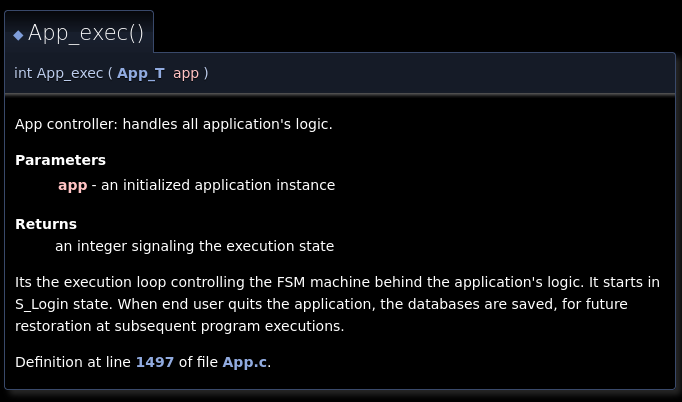


<a id="org2ec651d"></a>

## Available tools

There are several automatic source code documentation tools, typically language-specific, namely:

1.  `Doxygen`: C, C++, C\\#, Java, Objective-C, PHP, Python
2.  `GhostDoc`: C\\#, Visual Basic, C++, JavaScript
3.  `Javadoc`: Java only
4.  `Docurium` or `YARD`: Ruby
5.  `jsdoc`: Javascript
6.  `Sphinx`: Python, C/C++, Ruby, etc.


<a id="orge452fc1"></a>

## Doxygen     :Important:


<a id="orgee5f7e6"></a>

### Intro

-   Released in 1997 (24 years ago)
-   De facto standard tool for:
    -   Generating documentation from annotated C++ sources
        -   It supports also: C, Objective-C, C#, PHP, Java, Python, IDL (Corba, Microsoft, and UNO/OpenOffice flavors), Fortran, VHDL and to some extent D
    -   Static analysis tool for SW source trees
-   Supports the user in 2 ways:
    1.  **Flexibility in documentation generation**: It can generate an on-line documentation browser (in HTML) and/or an off-line reference manual (in LaTeX) from a set of documented source files. There is also support for generating output in RTF (MS-Word), PostScript, hyperlinked PDF, compressed HTML, and Unix man pages. The documentation is extracted directly from the sources, which makes it much easier to keep the documentation consistent with the source code.
    2.  **Assistance in reverse engineering SW**: You can configure doxygen to extract the code structure from undocumented source files. This is very useful to quickly find your way in large source distributions. Doxygen can also visualize the relations between the various elements by means of include dependency graphs, inheritance diagrams, and collaboration diagrams, which are all generated automatically.


<a id="org3be9e70"></a>

### Internal operation

[src](https://www.doxygen.nl/manual/arch.html)

**Data flow**:

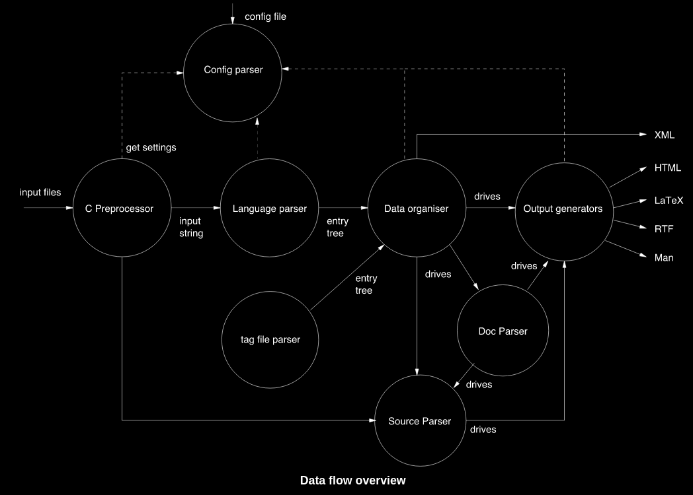

**Info flow**:


<a id="org6904ba7"></a>

### Installation

1.  Options <code>[1/2]</code>

    1.  [ ] From source code: github
        1.  Requires g++, python, cmake, flex, byson
            
            ```bash
            git clone https://github.com/doxygen/doxygen.git
            cd doxygen
            mkdir build
            cd build
            cmake -G "Unix Makefiles" ..
            make
            make install # install binaries
            ```
    2.  [X] Source distribution with latest release:
        1.  Obtain source code
            
            ```bash
             # create temporary folder and cd into it
             mkdir ~/tmp && cd ~/tmp
             # get compressed archive
            wget https://www.doxygen.nl/files/doxygen-1.9.2.src.tar.gz
            # uncompress
            gunzip doxygen-1.9.2.src.tar.gz 
            # tar -xzvf doxygen-1.9.2.src.tar.gz # or using tar
            # cd into the extracted folder
            cd doxygen-1.9.2
            ```
        2.  Build doxygen: requires g++, python, cmake, flex, byson - it takes about 3 mins
            
            ```bash
            mkdir build && cd build
            #cmake -Dbuild_wizard=YES .. # build Doxywizard (optional)
            cmake -G "Unix Makefiles" .. # build configuration
            make # build application
            sudo make install # install binaries
            ```
            
            1.  If it cmake aborts, inspect the output and install the appropriate package:
                
                ```bash
                sudo apt install flex # lexer generator
                sudo apt install bison # parser generator
                ```
        3.  obtain the path for doxygen executable
            
            ```bash
            which doxygen
            ```
    3.  Install additional utilities
        1.  Graphviz: Graph visualization tool - required to build diagrams
            
            ```bash
            sudo apt install graphviz
            ```


<a id="org159aea6"></a>

### Configuration

1.  GUI - Doxywizard

    1.  Enable cmake compilation flag and recompile
        
        ```bash
        mkdir build && cd build
        #cmake -Dbuild_wizard=YES .. # build Doxywizard (optional)
        cmake -G "Unix Makefiles" .. # build configuration
        make # build application
        sudo make install # install binaries
        ```
    2.  Check [docs](https://www.doxygen.nl/manual/doxywizard_usage.html)

2.  CLI - Doxyfile

    1.  Navigate to src code within git repository
        
        ```bash
        cd code/src
        ```
    2.  Open `makefile` in your editor of choice
        
        ```bash
        vim makefile
        ```
    3.  Look for documentation: `DOXYGEN` and `DOXYFILE` paths
        1.  Update these paths
    4.  Create directories to store documentation
        
        ```bash
        cd code
        mkdir -p doc/doxygen
        ```
    5.  Open Doxyfile and update the following variables:
        1.  We're invoking the Doxyfile from the makefile - UPDATE the path accordingly
            1.  `OUTPUT_DIRECTORY`: `../doc/doxygen`
            2.  `INPUT`: `.`
            3.  `USE_MFILE_AS_MAINPAGE` `../../readme.md`


<a id="org4c36435"></a>

### Build documentation

1.  Build doc
    
    ```bash
    cd code/src 
    make doc
    ```
2.  Inspect the `doc/doxygen` folder
    
    ```bash
    cd doc/doxygen
    ```
    
    1.  Check that 2 folders were built: `html` and `latex`
    2.  Navigate to `html` folder and open `index.html` in the background
        
        ```bash
        cd doc/doxygen/html
        xdg-open index.html &
        ```


<a id="org7e26a64"></a>

### Output analysis <code>[0/3]</code>

1.  [ ] Check `readme` file is present
2.  [ ] Explore `Data Structures`
3.  [ ] Explore `Files`


<a id="org2ce675c"></a>

### Usage

Now it's important to understand how to annotate source code files.

1.  Best practices to write good documentation

    -   **Simple and concise**. Follow the DRY (Don't Repeat Yourself)
    
    principle. Use comments to explain something that requires detailed information.
    
    -   **Up to date at all times**: the code should be documented when it's being written or modified.
    -   **Document any changes to the code**. Documenting new features or add-ons is pretty obvious. However, you should also document deprecated features, capturing any change in the product.
    -   **Simple language and proper formatting**: Code documents are typically written in English so that any developer could read the comments, regardless of their native language. The best practices for documentation writing require using the Imperative mood, Present tenses, preferably active voice, and second person.

2.  Documenting the code

    Doxygen uses special comment blocks, i.e., comment blocks with some additional markings to identify source code annotations for the documentation.
    
    1.  Description types
    
        For each entity in the code there are two (or in some cases three) types of descriptions, which together form the documentation for that entity, namely:
        
        -   **Brief description**: short one-liner, briefly documenting the following block. It is optional.
        -   **Detailed description**: provides more detailed documentation about the following block. It is optional.
        -   **Body description**: for methods and functions there is also a third type of description, consists of the concatenation of all comment blocks found within the body of the method or function.
    
    2.  Documentation style
    
        1.  `Javadoc` style: consists of a C-style comment block starting with two `*`, as follows:
            
            ```c
            /**
             * Javadoc style ... text ...
             */
            ```
        2.  `Qt style` add an exclamation mark (!) after the opening of a C-style comment block, as follows:
            
            ```c
            /*!
             * Qt style ... text ...
             */
            ```
        3.  `slash style`: use a block of at least two C++ comment lines, where each line starts with an additional slash or an exclamation mark, as follows:
            
            ```c
            ///
            /// slash style ... text ...
            ///
            ```
    
    3.  Documentation levels
    
        1.  **file**: used to describe modules or classes.
            
            ```c
            /**
             * @file App.h
             * @author Jose Pires
             * @date 12 Jan 2019
             *
             * @brief App module containing the application logic
             *
             * It contains only two public functions:
             * 1. Init - to initialize the app's memory
             * 2. Exec - contains all application logic
             */
            ```
        2.  **inline**: used to describe `#defines`, parameters, class members, and structure and enumeration fields.
            
            ```c
            #define DATABASE_USERS "user.db" /**< Database file for users */
            ```
        3.  **block**: used to describe classes, functions, structures, and enumerations.
            
            ```c
            /**
             * allocate dynamic memory and initialze App
             * @return initialized App_T
             */
            App_T App_init();
            ```
    
    4.  Documentation scope
    
        1.  **Public**: public interfaces are documented in the interface file (`.h`)
            
            ```c
            /**
             * allocate dynamic memory and initialze App
             * @return initialized App_T
             */
            App_T App_init();
            ```
        2.  **Private**: private interfaces are documented in the implementation file (`.c`)
            
            ```c
            /**
             * @brief Allocates memory for an App's instance
             * @return initialized memory for App
             *
             * It is checked by assert to determine if memory was allocated.
             * If assertion is valid, returns a valid memory address
             */
            static App_T App_new()
            {
                App_T app = malloc(sizeof(*app));
                assert(app);
                return app;
            }
            ```


<a id="org2bea328"></a>

# Plantuml

[PlantUML](https://plantuml.com/) is a tool for quickly drawing diagrams from text based descriptions. It is specially adequate for sequence diagrams, as draw.io is not very fluid.


<a id="org2a72f23"></a>

### Setup <code>[0/6]</code>

1.  [ ] Download PlantUML from the [website](https://sourceforge.net/projects/plantuml/files/plantuml.jar/download): `plantuml.jar`
2.  [ ] Place the `plantuml.jar` file into a known directory and add it to the path:
    
    ```bash
    cp ~/Downloads/plantuml.jar ~/
    ```
3.  [ ] Write a diagram text file in an extension `.pu` (example input/test.pu) - check the user manual for this
4.  [ ] Navigate to the `input` folder using cd
5.  [ ] Generate the diagram from the terminal using:
    
    ```bash
    java -jar plantuml.jar test.pu -o ../output/
    ```
6.  [ ] Check the generate png file: `output/test.png`


<a id="org48eac37"></a>

### Workflow <code>[0/4]</code>

1.  [ ] Write a diagram text file in an extension `.pu` (example input/test.pu) - check the user manual for this
2.  [ ] Navigate to the `input` folder using cd
3.  [ ] Generate the diagram from the terminal using:
    
    ```bash
    java -jar plantuml.jar test.pu -o ../output/
    ```
4.  [ ] Check the generate png file: `output/test.png`


<a id="org920db27"></a>

### Sequence diagrams

1.  Declaring participants

    If the keyword participant is used to declare a participant, more control on that participant is possible.
    
    The order of declaration will be the (default) order of display.
    
    Using these other keywords to declare participants will change the shape of the participant representation:
    
    1.  actor
    2.  boundary
    3.  control
    4.  entity
    5.  database
    6.  collections
    7.  queue
    
    ```plantuml
      ' title PlantUML (comment)
    @startuml
    
    participant Participant as Foo
    actor       Actor       as Foo1
    boundary    Boundary    as Foo2
    control     Control     as Foo3
    entity      Entity      as Foo4
    database    Database    as Foo5
    collections Collections as Foo6
    queue       Queue       as Foo7
    Foo -> Foo1 : To actor 
    Foo -> Foo2 : To boundary
    Foo -> Foo3 : To control
    Foo -> Foo4 : To entity
    Foo -> Foo5 : To database
    Foo -> Foo6 : To collections
    Foo -> Foo7: To queue
    
    @enduml
    ```
    
    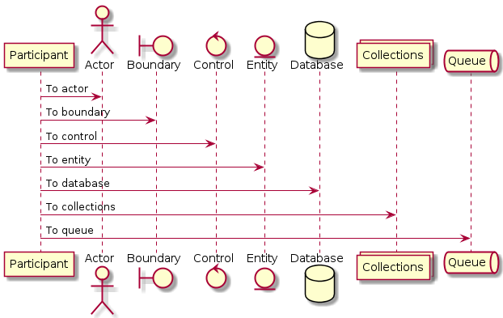

2.  Change arrow style

    You can change arrow style by several ways:
    
    1.  add a final x to denote a lost message
    2.  use \\ or / instead of < or > to have only the bottom or top part of the arrow
    3.  repeat the arrow head (for example, >> or //) head to have a thin drawing
    4.  use &#x2013; instead of - to have a dotted arrow
    5.  add a final "o" at arrow head
    6.  use bidirectional arrow <->
    
    ```plantuml
    @startuml
    ' comments as needed
    ' lost message
    Bob ->x Alice 
    ' sync message
    Bob -> Alice 
    ' async message
    Bob ->> Alice
    Bob -\ Alice
    Bob \\- Alice
    Bob //-- Alice
    
    Bob ->o Alice
    Bob o\\-- Alice
    
    ' bidirectional message
    Bob <-> Alice
    Bob <->o Alice
    @enduml
    ```
    
    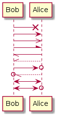

3.  Grouping messages

    ([src](https://plantuml.com/sequence-diagram#425ba4350c02142c))
    
    It is possible to group messages together using the following keywords:
    
    1.  alt/else
    2.  opt
    3.  loop
    4.  par
    5.  break
    6.  critical
    7.  group, followed by a text to be displayed
    
    It is possible to add a text that will be displayed into the header (for group, see next paragraph 'Secondary group label').
    
    The end keyword is used to close the group.
    
    Note that it is possible to nest groups.
    
    ```plantuml
      ' title PlantUML (comment)
    @startuml
    Alice -> Bob: Authentication Request
    
    alt successful case
    
        Bob -> Alice: Authentication Accepted
    
    else some kind of failure
    
        Bob -> Alice: Authentication Failure
        group My own label
        Alice -> Log : Log attack start
    	loop 1000 times
    	    Alice -> Bob: DNS Attack
    	end
        Alice -> Log : Log attack end
        end
    
    else Another type of failure
    
       Bob -> Alice: Please repeat
    
    end
    @enduml
    ```
    
    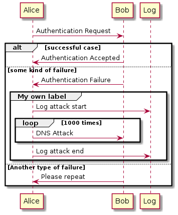

4.  Notes on messages

    It is possible to put notes on message using the note left or note right keywords just after the message.
    
    You can have a multi-line note using the end note keywords.
    
    ```plantuml
    @startuml
    Alice->Bob : hello
    note left: this is a first note
    
    Bob->Alice : ok
    note right: this is another note
    
    Bob->Bob : I am thinking
    note left
    a note
    can also be defined
    on several lines
    end note
    @enduml
    ```
    
    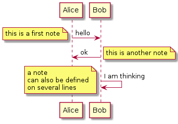

5.  Divider or separator

    If you want, you can split a diagram using == separator to divide your diagram into logical steps.
    
    ```plantuml
    @startuml
    
    == Initialization ==
    
    Alice -> Bob: Authentication Request
    Bob --> Alice: Authentication Response
    
    == Repetition ==
    
    Alice -> Bob: Another authentication Request
    Alice <-- Bob: another authentication Response
    
    @enduml
    ```
    
    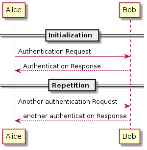

6.  Lifeline activation and destruction

    The `activate` and `deactivate` are used to denote participant activation.
    
    Once a participant is activated, its lifeline appears.
    
    The activate and deactivate apply on the previous message.
    
    The `destroy` denote the end of the lifeline of a participant.
    
    ```plantuml
    @startuml
    participant User
    
    User -> A: DoWork
    activate A
    
    A -> B: << createRequest >>
    activate B
    
    B -> C: DoWork
    activate C
    C --> B: WorkDone
    destroy C
    
    B --> A: RequestCreated
    deactivate B
    
    A -> User: Done
    deactivate A
    
    @enduml
    ```
    
    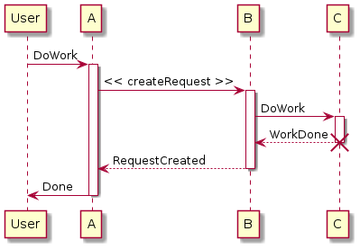

7.  Participant creation

    You can use the `create` keyword just before the first reception of a message to emphasize the fact that this message is actually creating this new object.
    
    ```plantuml
    @startuml
    Bob -> Alice : hello
    
    create Other
    Alice -> Other : new
    
    create control String
    Alice -> String
    note right : You can also put notes!
    
    Alice --> Bob : ok
    
    @enduml
    ```
    
    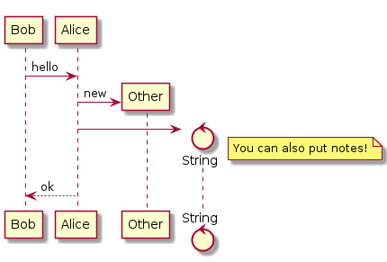

8.  Incoming and outgoing messages

    You can use incoming or outgoing arrows if you want to focus on a part of the diagram.
    
    Use square brackets to denote the left "[" or the right "]" side of the diagram.
    
    ```plantuml
    @startuml
    [-> A: DoWork
    
    activate A
    
    A -> A: Internal call
    activate A
    
    A ->] : << createRequest >>
    
    A<--] : RequestCreated
    deactivate A
    [<- A: Done
    deactivate A
    @enduml
    ```
    
    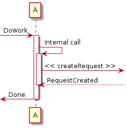

9.  Anchors and duration

    With `teoz` it is possible to add anchors to the diagram and use the anchors to specify duration time.
    
    ```plantuml
    @startuml
    !pragma teoz true
    
    {start} Alice -> Bob : start doing things during duration
    Bob -> Max : something
    Max -> Bob : something else
    {end} Bob -> Alice : finish
    
    {start} <-> {end} : some time
    
    @enduml
    ```
    
    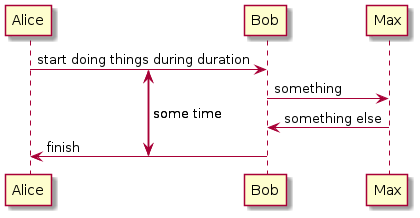
    
    You can use the -Pcommand-line option to specify the pragma:
    
    ```bash
    java -jar plantuml.jar -Pteoz=true
    ```

10. Participants encompass

    It is possible to draw a box around some participants, using box and end box commands.
    
    You can add an optional title or a optional background color, after the box keyword.
    
    ```plantuml
    @startuml
    
    box "Internal Service" #LightBlue
    participant Bob
    participant Alice
    end box
    participant Other
    
    Bob -> Alice : hello
    Alice -> Other : hello
    
    @enduml
    ```
    
    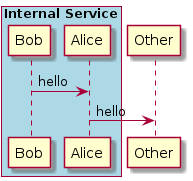

11. Remove foot boxes

    You can use the `hide footbox` keywords to remove the foot boxes of the diagram.
    
    ```plantuml
    @startuml
    
    hide footbox
    title Foot Box removed
    
    Alice -> Bob: Authentication Request
    Bob --> Alice: Authentication Response
    
    @enduml
    ```
    
    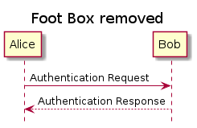

12. Style `strictuml`

    To be conform to strict UML (for arrow style: emits triangle rather than sharp arrowheads), you can use:
    
    ```plantuml
    @startuml
    skinparam style strictuml
    Bob -> Alice : hello
    Alice -> Bob : ok
    @enduml
    ```
    
    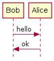

13. Color a group message

    It is possible to color a group message:
    
    ```plantuml
    @startuml
    Alice -> Bob: Authentication Request
    alt#Gold #LightBlue Successful case
        Bob -> Alice: Authentication Accepted
    else #Pink Failure
        Bob -> Alice: Authentication Rejected
    end
    @enduml
    ```
    
    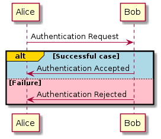

14. Colors

    You can use specify **fill** and **line** colors either:
    
    1.  with its standard name or CSS name
    2.  using HEX value (6 digits): #RRGGBB
    3.  using HEX value (8 digits) with alpha compositing or RGBA color model: \#RRGGBBaa
    4.  using short HEX value (3 digits): #RGB
    
    ```plantuml
    @startuml
    actor Bob #Red/Yellow
    actor Alice #FF0000/FFFF00
    Alice -> Bob : hello
    @enduml
    ```
    
    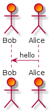

15. All together     :Important:

    This example tries to combine all the most important tips stated previously.
    
    ```plantuml
    @startuml
    ' ---------- SETUP ----------------
    ' strict uml style and hide footboxes
    skinparam style strictuml
    hide footbox
    ' for anchors and duration this may be required (uncomment)
    ' !pragma teoz true
    
    
    ' ---------- Declaring participants
    participant Participant as Foo
    actor       Actor       as Foo1
    boundary    Boundary    as Foo2
    control     Control     as Foo3
    entity      Entity      as Foo4
    database    Database    as Foo5
    collections Collections as Foo6
    queue       Queue       as Foo7
    Foo -> Foo1 : To actor 
    Foo -> Foo2 : To boundary
    Foo -> Foo3 : To control
    Foo -> Foo4 : To entity
    Foo -> Foo5 : To database
    Foo -> Foo6 : To collections
    Foo -> Foo7: To queue
    
    ' -------- Grouping messages ------------------
    ' divider or separator
    ' Encompass actors
    ' add colors to cases
    ' add notes
    == Initialization ==
    
    box "Internal Service" #LightBlue
    participant Bob
    participant Alice
    end box
    Alice -> Bob: Authentication Request
    alt#Gold #LightBlue Successful case
        Bob -> Alice: Authentication Accepted
        note left: this is a first note
    else #Pink Failure
        Bob -> Alice: Authentication Rejected
        note right: this is a 2nd note
    end
    
    == Repetition ==
    
    Alice -> Bob: Another authentication Request
    Alice <-- Bob: another authentication Response
    
    
    Alice -> Bob: Authentication Request
    
    alt successful case
    
        Bob -> Alice: Authentication Accepted
    
    else some kind of failure
    
        Bob -> Alice: Authentication Failure
        group My own label
        Alice -> Log : Log attack start
    	loop 1000 times
    	    Alice -> Bob: DNS Attack
    	end
        Alice -> Log : Log attack end
        end
    
    else Another type of failure
    
       Bob -> Alice: Please repeat
    
    ' ---------- Anchors and duration
    {start} Alice -> Bob : start doing things during duration
    Bob -> Max : something
    Max -> Bob : something else
    {end} Bob -> Alice : finish
    
    {start} <-> {end} : some time
    
    ' --------- Incoming and outgoing messages
    [-> A: DoWork
    
    activate A
    
    A -> A: Internal call
    activate A
    
    A ->] : << createRequest >>
    
    A<--] : RequestCreated
    deactivate A
    [<- A: Done
    deactivate A
    
    ' -------  Participant creation ---------
    Bob -> Alice : hello
    
    create Other
    Alice -> Other : new
    
    create control String
    Alice -> String
    note right : You can also put notes!
    
    Alice --> Bob : ok
    
    '-------- Lifeline activation/deactivation
    participant User
    
    User -> A: DoWork
    activate A
    
    A -> B: << createRequest >>
    activate B
    
    B -> C: DoWork
    activate C
    C --> B: WorkDone
    destroy C
    
    B --> A: RequestCreated
    deactivate B
    
    A -> User: Done
    deactivate A
    
    @enduml
    ```
    
    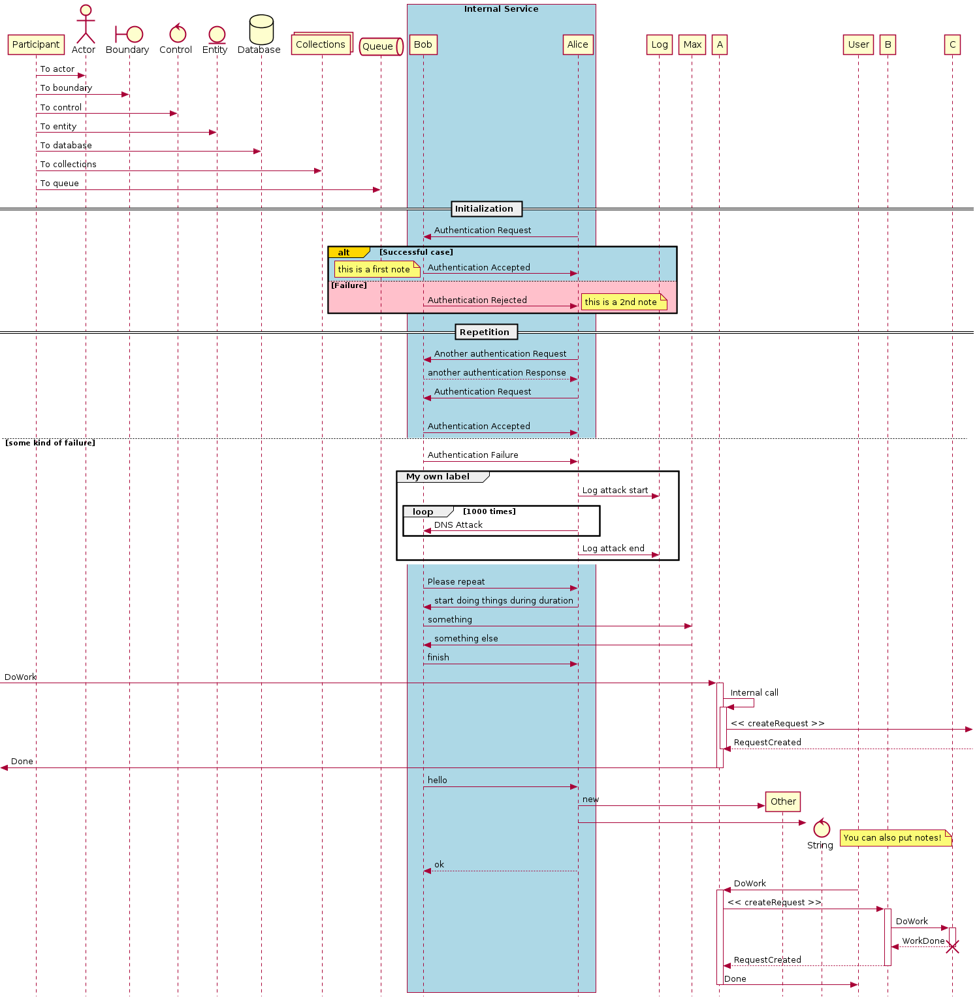


<a id="orge076dff"></a>

### Class Diagrams

1.  Relations between classes

    Class01 <|&#x2013; Class02 ' extension Class03 \*&#x2013; Class04 ' composition Class05 o&#x2013; Class06 ' aggregation

2.  Visibility

    -field1 */ private \#field2 /* protected ~method1() */ package private +method2() /* public

3.  Static and abstract

    You can define static or abstract methods or fields using the {static} or {abstract} modifier.These modifiers can be used at the start or at the end of the line. You can also use {classifier} instead of {static}.

4.  Notes

    You can also define notes using note left of, note right of, note top of, note bottom of keywords. `note top of Flight : default class\ndiagram.` You can also define a note on the last defined class using note left, note right, note top, note bottom. A note can be also define alone with the note keywords, then linked to other objects using the .. symbol. `Object .. N2`

5.  Example

    


<a id="org2a05415"></a>

### Use case diagrams

1.  Define actors and usecases

    Actors and use cases can be defined with the reserved keywords `actor` and `usecase`.
    
        actor zekinha Susana
        usecase eat
        usecase sleep
        usecase watchSupernatural
        usecase studyForTest
    
    Also it can be defined on the fly using `:Actor-name:` and `(usecase-name)`.
    
    Additionally, it can also be used the alias `as`, to define shorter names for usecases and actors
    
        :Main Admin: as Admin
        (Use the application) as (Use)
        User -> (Start)
        User --> (Use)
        Admin ---> (Use)

2.  Direction

    The default direction is `top to bottom direction` but it can be changed to `left to right direction`.

3.  Example

    <diags/plantuml/usecases/usecase-test>


<a id="orgf5debfe"></a>

### State Diagrams

1.  Basic Syntax

    [\*] = initial state and final state &#x2013;> = arrows S1 &#x2013;> S2 : <transition> S1 : <text inside state> (can be used for outputs in Moore cycle)

2.  Composite State

    -   Use the `state` keywords and braces `{}`

3.  Notes

    Notes can be defined using:
    
    -   `note left of`
    -   `note right of`
    -   `note top of`
    -   `note bottom of`
    
    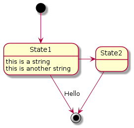


<a id="org98b8ef4"></a>

# Makefiles

-   check example on `code/src/makefile`
